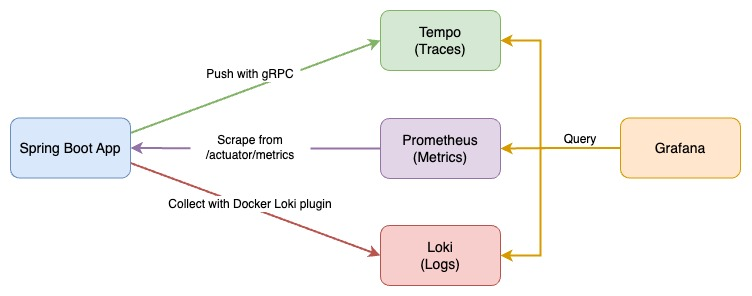
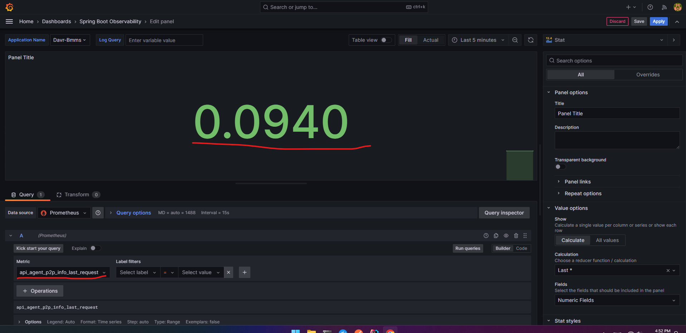

# Dynamic Observability

Metrics support offers a way to create timers, gauges, or counters for collecting statistics about the runtime behavior 
of your application. Metrics can help you to track error rates, usage patterns, performance, and more. Traces provide a 
holistic view of an entire system, crossing application boundaries; you can zoom in on particular user requests and 
follow their entire completion across applications.



# Getting Started

Make sure you are using Spring Boot version 2.4.7 or above.

```xml
<!-- plugin -->
<dependency>
    <groupId>uz.devops</groupId>
    <artifactId>spring-boot-dynamic-observability</artifactId>
    <version>1.0.0</version>
</dependency>
<!-- libraries used within the plugin -->
<dependency>
    <groupId>io.micrometer</groupId>
    <artifactId>micrometer-core</artifactId>
    <version>1.11.6</version>
</dependency>
<dependency>
    <groupId>io.micrometer</groupId>
    <artifactId>micrometer-registry-prometheus</artifactId>
    <version>1.11.6</version>
</dependency>
```

After adding the dependency, set up your bot by adding the promethus in your application.yml file

```yaml
management:
    endpoints:
        web:
            exposure:
                include:
                    [
                        'prometheus',
                    ]
```

# Next Step Getting Started. Configuring promethues.yml

```yaml
scrape_configs:
  - job_name: 'Dynamic-Observability'
    metrics_path: '/actuator/prometheus'
    scrape_interval: 3s
    static_configs:
      - targets: ['host.docker.internal:8080']
        labels:
          application: 'Dynamic-Observability-Application'
```

We need to do the next task, we have to set the port for our program in the prometheus.yml file.

```yaml
 - targets: ['host.docker.internal:8080'] # - We want to run on port here, so we need to write it accordingly
```

If the program has changed its metrics path, then we need to indicate that as well.

Metrics base-path changed!
```yaml
management:
    endpoints:
        web:
            base-path: /management
            exposure:
                include:
                    [
                        'configprops',
                        'env',
                        'health',
                        'info',
                        'jhimetrics',
                        'logfile',
                        'loggers',
                        'prometheus',
                        'threaddump',
                        'caches',
                        'liquibase',
                    ]
```

```yaml
scrape_configs:
  - job_name: 'Dynamic-Observability'
    metrics_path: '/management/prometheus'
    scrape_interval: 3s
    static_configs:
      - targets: ['host.docker.internal:8080']
        labels:
          application: 'Dynamic-Observability-Application'
```

# How To Use

The APIs and interfaces named `RestRegistryManager` have been introduced for using this plugin. Let's take a look at the 
first RestRegistryManager interface.

```java
public interface RestRegistryManager {

    /*
        The 'add' method is used to register an API, and then we can view the statistics of our API. Otherwise, we cannot
        see the statistics of our APIs. The plugin monitors only the registered APIs and collects statistics for them    
     */
    void add(Resource resource); 

    void addAll(Set<Resource> resources);

    /*
        The 'remove' method is used to stop monitoring APIs, meaning it removes the specified API from the registry of 
        APIs to be monitored, halting the monitoring of that particular API.    
     */
    void remove(Resource resource);

    void removeAll(Set<Resource> resources);

    /*
        The 'clear' method removes and stops monitoring all the APIs that are currently being observed.    
     */
    void clear();

    /*
        We can utilize the 'find' method to obtain the API being monitored by its name.
     */
    Optional<Resource> find(String name);

    /*
        Using the 'find' method, we can retrieve the monitored API based on its URI and HTTP method
     */
    Optional<Resource> find(String uri, RequestMethod method);

    /*
        The 'contains' method returns true if it is the same as the 'find' method, otherwise, it returns false.    
     */
    boolean contains(String name);

    boolean contains(String uri, RequestMethod method);

    /*
       The 'findAll' method is used to obtain all currently monitored APIs.  
     */
    Set<Resource> findAll();
}
```

Now, let's take a look at all the APIs in the plugin.

```java
@RestController
@RequestMapping(value = "/api")
public class ObservabilityResource {

    /*
        We can send a request to /api/observability/types to obtain observation types.    
     */
    @GetMapping(value = "/observability/types")
    public ResponseEntity<Set<ObserveTypeDTO>> getObserveTypes() {
        // ...
    }

    @GetMapping(value = "/observability")
    public ResponseEntity<Set<Resource>> findAllObserve() {
        // ...
    }

    @PostMapping(value = "/observability")
    public ResponseEntity<Resource> deleteObserve(@Valid @RequestBody ObserveCreateDTO dto) {
        // ...
    }

    @DeleteMapping(value = "/observability/{name}")
    public ResponseEntity<Resource> deleteObserve(@PathVariable String name) {
        // ...
    }

    @GetMapping(value = "/observability/{name}")
    public ResponseEntity<Resource> findOneObserve(@PathVariable String name) {
        // ...
    }

    @PutMapping(value = "/observability")
    public ResponseEntity<Resource> updateObserve(@Valid @RequestBody ObserveUpdateDTO dto) {
        // ...
    }

    @PatchMapping(value = "/observability")
    public ResponseEntity<Resource> partialUpdateObserve(@RequestBody ObserveUpdateDTO dto) {
        // ...
    }

}
```

## ObserveType

What is ObserveType? ObserveType indicates what information needs to be observed for the registered API and specifies how
to monitor it. For example, it could indicate that we only need to see how many requests our API received or how much time
it spent. It is a type that allows specifying what aspect of observation is needed.

```java
public enum ObserveType {

    TIMER, LAST_REQUEST, COUNTER

}
```

- `TIMER` - Timer intended to track of a large number of short running events. Example would be something like an HTTP request. 
  Though "short running" is a bit subjective the assumption is that it should be under a minute.
- `COUNTER` - Counters monitor monotonically increasing values. Counters may never be reset to a lesser value. If you 
  need to track a value that goes up and down
- `LAST_REQUEST` - LastRequest is designed to monitor how long the last HTTP request took to complete.

## Resource

```json
{
    "name": "p2p-pay", // name unique bo'lishi shart! sababi 'name' Resourceda identifier vazifasini bajaradi yani id.
    "uri": "/api/agent/p2p/pay", // http://localhost:8080/api/agent/p2p/pay to'liq url shunday bo'lsa biz faqat shundan uri o'zini berishimiz kerak yani 'localhost:8080' dan keyin kelgan barcha pathni.
    "method": "POST", // methodga Request Method berilishi kerak!
    "observe_types": ["LAST_REQUEST", "COUNTER"] // kamida bitta ObserveType berilishi kerak!
}
```

## Metrics Name

```json
{
    "name": "p2p-info",
    "uri": "/api/agent/p2p/info",
    "method": "POST",
    "observe_types": [
        "LAST_REQUEST",
        "TIMER"
    ],
    "metrics_name": [
        "api_agent_p2p_info_timer_seconds_max",
        "api_agent_p2p_info_timer_seconds_count",
        "api_agent_p2p_info_last_request",
        "api_agent_p2p_info_timer_seconds_sum"
    ]
}
```

In the API being monitored, there is also a field named 'metrics_name.' What is the purpose of this? This field allows
us to specify the metric name for our API, using which we can view statistics in Grafana. By using this name, we can
visualize the statistics of our API.

